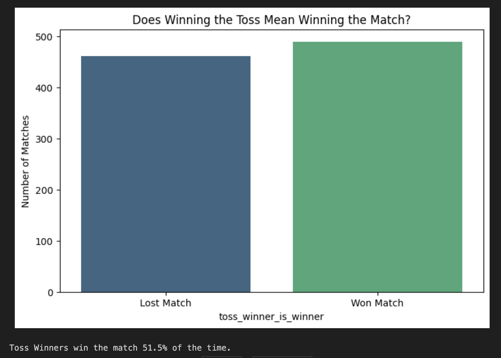
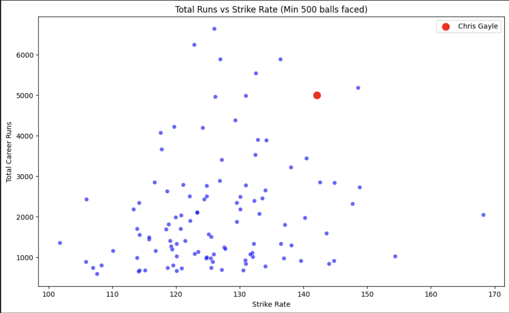
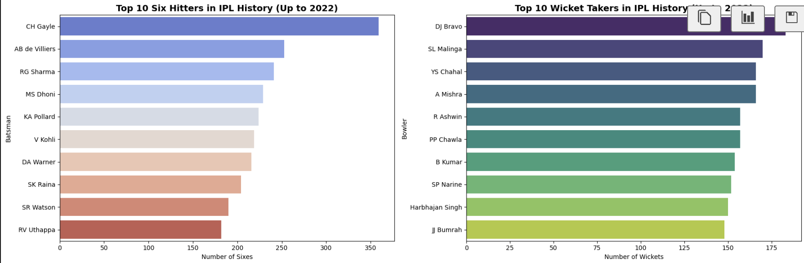

# IPL Data Analysis & Match Insights (2008-2022)

**Executive Summary:** This project analyzes historical IPL data from 2008 to 2022 to uncover key trends in player performance and match outcomes. The most significant finding reveals that winning the toss has a surprisingly minimal impact on winning the match.

**Data Pipeline:**
- Cleaned and standardized team names across different seasons.
- Handled null values in match outcomes and player details appropriately.
- Merged the delivery-level and match-level datasets for comprehensive analysis.

**Key Insights:**
- The "Chris Gayle Anomaly" (Highlighting that he hit 41% more sixes than the #2 player).
- The "Toss Illusion" (Proving mathematically that winning the toss only results in winning the match ~51.5% of the time).
- Player value (Volume of runs vs. Man of the Match awards).

**Visualizations:**




**How to Run:**
```bash
# Clone the repository
git clone https://github.com/Rehanku/ipl-eda-portfolio.git
cd ipl-eda-portfolio

# Create a virtual environment
python3 -m venv .venv

# Activate the virtual environment
source .venv/bin/activate

# Install the required packages
pip install -r requirements.txt

# Run Jupyter Notebook
jupyter notebook notebooks/01_EDA.ipynb
```
